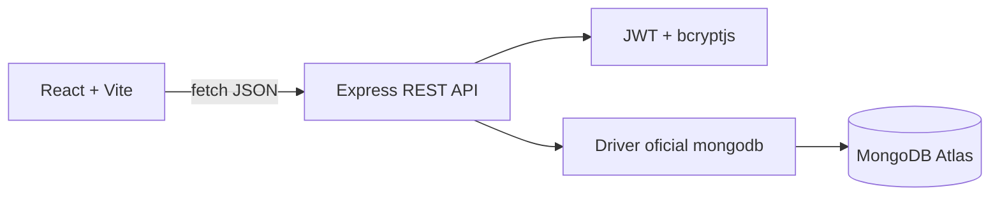

# Pulso · Microblog PEC 5

Mini aplicación full stack creada con apoyo de IA para la PEC 5 de Desarrollo Web Full Stack. El administrador autenticado publica, edita y elimina entradas. Cualquier visitante puede leer, dar like o dislike y comentar indicando un nombre, sin crear una cuenta.

## Resultado y alcance

- CRUD completo de la entidad principal `publicaciones`: crear, listar, editar y borrar.
- Login exclusivo para un administrador que ya existe en MongoDB; no hay registro público.
- Comentarios anónimos con nombre visible y validación de longitud.
- Publicaciones públicas o privadas: el administrador elige al crearlas y puede cambiar la privacidad al editarlas.
- Eliminación de cualquier comentario desde la sesión de administrador.
- Likes y dislikes sin registro. El navegador recibe un identificador local para alternar o cambiar su reacción.
- Imágenes y GIF en las publicaciones mediante `multipart/form-data`, con un máximo de 15 MB.
- API REST con respuestas JSON, códigos HTTP, validación y middlewares 404/500.
- Frontend React/Vite con componentes reutilizables, `useState`, `useEffect`, formularios controlados y `fetch`.
- MongoDB con el driver oficial `mongodb`, sin Mongoose, para respetar el enfoque trabajado en el curso.

## Arquitectura



```text
PEC 5/
├── backend/
│   ├── scripts/seed-admin.js
│   ├── uploads/               imágenes subidas, ignoradas por Git
│   ├── src/
│   │   ├── config/          conexión reutilizable a MongoDB
│   │   ├── controllers/     petición, validación y respuesta
│   │   ├── middlewares/     autorización, 404 y errores
│   │   ├── models/          funciones del driver oficial
│   │   ├── routes/          contrato de endpoints
│   │   └── utils/           validaciones puras
│   └── test/                pruebas unitarias
├── frontend/
│   └── src/
│       ├── components/      piezas de interfaz reutilizables
│       ├── services/api.js  única capa de peticiones HTTP
│       └── App.jsx          estado y coordinación general
├── PLAN.md
├── AGENTS.md
├── SKILLS.md
├── TASKS.md
├── requests.http
└── microblog.postman_collection.json
```

## Instalación local

Requisitos: Node.js 20 o posterior, npm y una base MongoDB Atlas accesible.

1. Crea localmente `backend/.env` y define `MONGODB_URI`, `MONGODB_DB`, `JWT_SECRET`, `ADMIN_USERNAME`, `ADMIN_PASSWORD`, `PORT` y `CLIENT_ORIGIN`. Este archivo está ignorado por Git.
2. Crea localmente `frontend/.env` con `VITE_API_URL=http://localhost:4000`. También está ignorado por Git.
3. Desde la raíz ejecuta `npm run install:all`.
4. Prepara el usuario administrador existente o créalo de forma controlada con `cd backend` y `npm run seed:admin`. El script guarda únicamente el hash de la contraseña.
5. En una terminal ejecuta `npm run dev:backend`.
6. En otra terminal ejecuta `npm run dev:frontend`.
7. Abre `http://localhost:5173`.

El acceso de administración aparece bajo la introducción. Los visitantes no necesitan iniciar sesión.

## Modelo de datos

### usuarios

```js
{
  _id: ObjectId,
  usuario: String,
  password: String, // hash bcrypt, nunca texto plano
  rol: "admin"
}
```

### publicaciones

```js
{
  _id: ObjectId,
  contenido: String,
  adminId: ObjectId,
  autor: String,
  createdAt: Date,
  updatedAt: Date,
  reactions: { likes: [String], dislikes: [String] },
  imagenUrl: String | null,
  privado: Boolean,
  comments: [{
    _id: ObjectId,
    nombre: String,
    texto: String,
    autorAdmin: Boolean,
    createdAt: Date
  }]
}
```

Comentarios y reacciones se guardan dentro de la publicación porque son datos pequeños y siempre se muestran con ella. En una aplicación con mucho tráfico se separarían en colecciones para evitar documentos demasiado grandes.

## API

| Método y ruta | Acceso | Finalidad |
|---|---|---|
| `GET /api/health` | público | comprobar que la API responde |
| `POST /api/auth/login` | público | autenticar al administrador |
| `GET /api/auth/me` | admin | comprobar el token |
| `GET /api/posts` | público/admin | listar públicas; con JWT también incluye privadas |
| `POST /api/posts` | admin | crear una publicación |
| `PATCH /api/posts/:id` | admin | editar una publicación |
| `DELETE /api/posts/:id` | admin | borrar una publicación |
| `POST /api/posts/:id/comments` | público | añadir comentario |
| `DELETE /api/posts/:id/comments/:commentId` | admin | eliminar comentario |
| `POST /api/posts/:id/reactions` | público | alternar like o dislike |

Usa `requests.http` o la colección Postman para comprobar el flujo completo. El backend también incluye pruebas unitarias de validación: `npm test --prefix backend`.

## Decisiones técnicas justificadas

- **Driver oficial en lugar de Mongoose.** Es el acceso a MongoDB usado en las sesiones del curso y hace explícitos `find`, `insertOne`, `updateOne`, `deleteOne` y `ObjectId`.
- **JWT solo para el administrador.** La API no confía en un campo de autor enviado por el cliente. El middleware obtiene la identidad del token y verifica que el usuario siga siendo administrador.
- **Privacidad aplicada en el servidor.** `GET /api/posts` funciona para todos; con un JWT válido incluye también las publicaciones privadas. Sin token se excluyen desde la consulta a MongoDB. Comentarios, reacciones e imágenes de una publicación privada también quedan protegidos.
- **Multer para imágenes.** El servidor acepta un único archivo cuyo MIME empiece por `image/`, conserva GIF animado y otros formatos y genera un nombre aleatorio para evitar colisiones o rutas manipuladas.
- **Sin registro público.** Cumple el requisito de que solo el propietario publique y reduce datos personales y superficie de ataque.
- **Token en memoria de React.** Al recargar se cierra la sesión; es una decisión sencilla para la PEC y evita persistir el token en `localStorage`.
- **Identificador local para reacciones.** Permite alternar una reacción por navegador sin convertir a los visitantes en usuarios. No pretende ser un sistema antifraude fuerte.
- **Estado actualizado después de confirmar la API.** Crear, editar, borrar, comentar o reaccionar solo cambia la interfaz cuando el servidor confirma la operación.
- **Una capa `services/api.js`.** Centraliza URL, JSON, cabeceras, token y tratamiento de errores para no repetir `fetch` en cada componente.

## Uso crítico de IA

Herramienta utilizada: ChatGPT/Codex. Se usó para revisar el material del curso y el enunciado, proponer la arquitectura, generar una primera versión del código, redactar comentarios útiles, crear pruebas y preparar la documentación.

La decisión funcional, el modelo final y las restricciones fueron indicados por el alumno: microblog tipo X, un único administrador existente y visitantes anónimos. El código se adaptó expresamente para no usar Mongoose aunque la plantilla de la PEC lo menciona.

Correcciones realizadas durante la revisión:

- Se evitó aplicar `$pull` y `$addToSet` sobre el mismo campo en una única actualización de MongoDB, porque produciría un conflicto. Ahora cada rama de la reacción modifica rutas compatibles.
- Se separó el token del identificador de visitante: uno autoriza acciones privadas y el otro solo mejora la experiencia de reacciones públicas.
- Se impidió que el cliente elija el autor; el backend lo obtiene del administrador autenticado.
- Se añadieron límites de longitud, validación de `ObjectId`, errores JSON y un borrado confirmado desde la interfaz.
- Las publicaciones privadas se filtran en MongoDB y sus imágenes se sirven mediante una ruta que comprueba la sesión; ocultarlas solo con CSS no sería seguridad.
- Se mantuvieron comentarios solo donde explican una decisión que no resulta obvia.

### Reflexión

La IA aceleró la estructura inicial, la repetición de endpoints y la documentación. Lo más difícil de controlar fue la coherencia entre seguridad, modelo de datos y experiencia anónima: una solución aparentemente cómoda podía permitir publicar sin autorización o duplicar votos sin límite. Revisar el código obligó a entender mejor el orden de middlewares, el contrato HTTP, la diferencia entre identidad autenticada e identificador local y las restricciones de actualización de MongoDB. Volvería a usar IA para una aplicación similar, pero manteniendo pruebas, revisión por capas y decisiones propias antes de aceptar el resultado.

## Despliegue pendiente

El código está preparado para desplegar backend y frontend por separado. Antes de entregar en Classroom quedan acciones externas que no se pueden realizar sin las cuentas del alumno: crear el repositorio GitHub, configurar los secretos en Render/Vercel, permitir la red necesaria en Atlas y pegar las URLs finales en este README.

La carpeta local `backend/uploads` no es persistente en muchos proveedores serverless o PaaS. Para un despliegue con imágenes permanentes debe sustituirse por Cloudinary, S3 u otro almacenamiento de objetos y guardar su URL en MongoDB.
